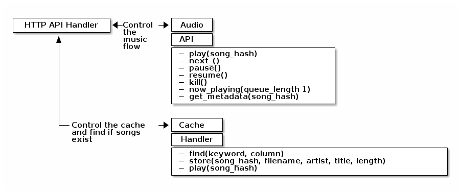

tikplay
=======

New implementation of tikplay. Legacy software contained in the LEGACY directory.

Requirements
============

Apart from what is listed in `requirements.txt` (can be installed with pip), libmp3lame is also required for youtube-dl

Architecture
============

## Client to Server architecture and API


## Server to Audio architecture and Audio API



## Cache architecture


## Audio architecture


## Database architecture


Client
======

You can use the client locally but you need to pipe your connection
through, for example, kekkonen. The following example will deploy the
tikplay (server & client) on your machine. Pre-requisites:
	- SSH with key authentication enabled
	- Python 3.3 installed
	- Pip installed for Python 3.3

```
$ git clone https://github.com/tietokilta-saato/tikplay.git
$ cd tikplay
$ pip install --user -r requirements.txt
$ ssh -f -N -L 5000:tikradio.tt.hut.fi:5000 <username>@kekkonen.cs.hut.fi
$ echo "{\"host\": \"localhost:5000\", \"verbose\": true}" > ~/.tikplayrc
$ python client --help
```
