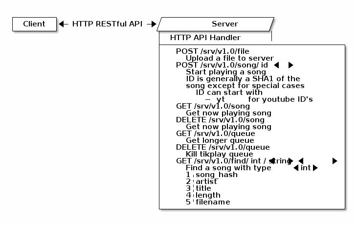
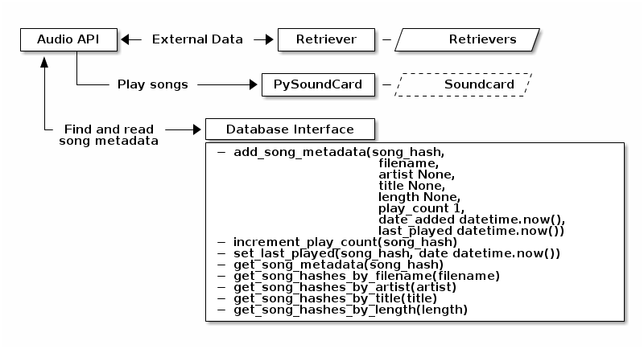
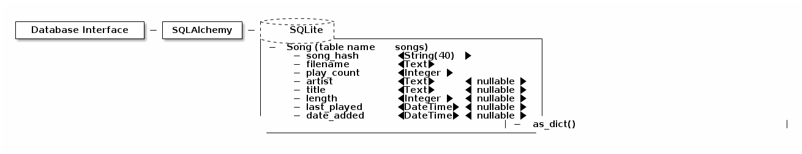

tikplay
=======

New implementation of tikplay. Legacy software contained in the LEGACY directory.

Requirements
============

Apart from what is listed in `requirements.txt` (can be installed with pip), libmp3lame is also required for youtube-dl

Architecture
============

## Client to Server architecture and API

## Server to Audio architecture and Audio API

## Audio architecture

## Database architecture

